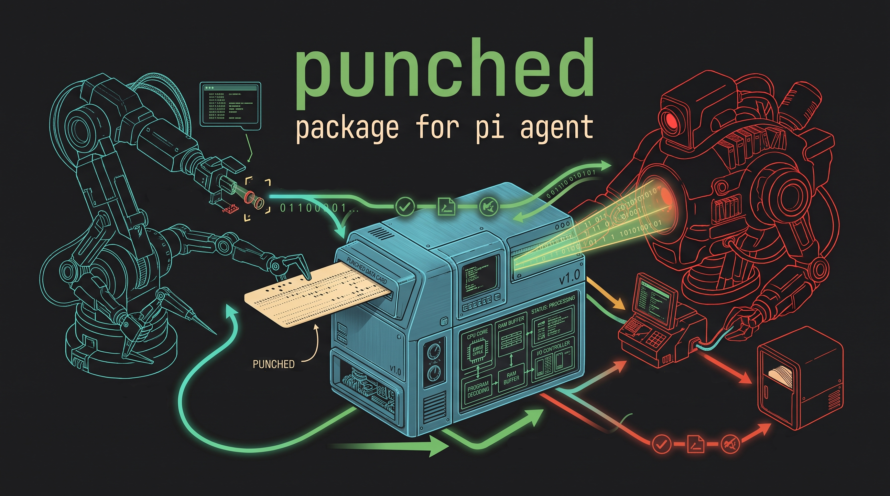

<p align="center">
  
</p>

<h1 align="center">🪡 punched-memory</h1>

<p align="center">
  <strong>Persistent per-directory project memory for the <a href="https://pi.dev">pi coding agent</a>.</strong><br>
  A structured <code>pi.md</code> in every working directory — private, gitignored, recoverable across sessions.
</p>

<p align="center">
  <a href="https://github.com/noguerol/punched-memory/blob/main/LICENSE"></a>
  
  
  
  
</p>

---

`punched-memory` (alias: `punched`) keeps a structured `pi.md` file in
**every working directory** you use with pi. The file is **private** — it is
auto-added to `.gitignore` whenever the directory is a git repo — and
stores the entire project memory across sessions: scope, decisions,
gotchas, TODO checklist and a per-session working log. Content is written
in the user's interaction language (auto-detected or explicitly chosen)
and includes session IDs, timestamps, and structured sub-sections so a
fresh session can recover context immediately.

When you re-enter a directory, `punched` keeps the existing `pi.md` so
context is available, but it does **not** interrupt you with a recall
prompt by default. When you want to browse or inject a past session
summary into the editor, run `/punched session` (or pick the **Recall
previous sessions** entry from the main menu). You can flip the
auto-prompt back on via `/punched-memory config → Recall prompt`.

---

## ✨ Features

| | |
|---|---|
| 🪡 **`pi.md` per cwd** | one file, stable structured format with YAML front-matter and well-known sections |
| 🧠 **Decisions log** | date, why, trade-offs and alternatives (as a markdown list) |
| ⚠️ **Gotchas** | title + description + date, easy to grep later |
| ✅ **TODO checklist** | split into Pending / Done, toggleable by id |
| 📝 **Session log** | id, start/end timestamps, title, summary, decisions, files, open questions |
| 🌍 **i18n** | 9 languages (en, es, fr, de, it, pt, ja, zh, ru); auto-detect or explicit |
| 🎨 **Visual TUI** | animated banner, needle spinner, boxed menus, recall view, config |
| 🔒 **Private by default** | auto-patches `.gitignore` in git repos (also for `.punched-memory.json`) |
| 🤖 **LLM tools** | `punched_log`, `punched_todo`, `punched_session`, `punched_recall` |
| 💾 **Layered config** | global `~/.pi/agent/punched-memory/config.json` + per-project `.punched-memory.json` |
| 🪝 **Manual recall** | `/punched session` opens the recall view, no auto-interrupt |
| 🛡️ **Strict TypeScript** | full `strict` mode, zero `any` in public APIs |

---

## 📦 Install

### One-line install

```bash
pi install git:github.com/noguerol/punched-memory
```

That's it. Reload pi with `/reload` and `punched` will be active on
the next session start.

### From a local clone (development)

```bash
git clone https://github.com/noguerol/punched-memory
cd punched-memory
npm install
ln -sfn "$(pwd)" ~/.pi/agent/extensions/punched-memory
```

Then `/reload` in pi.

### From npm (when published)

```bash
pi install npm:punched-memory
```

---

## 🎯 Commands

All commands also work under the `/punched` alias.

| Command | Description |
|---|---|
| `/punched-memory` | Open the visual **main menu** (status, recall, log, todos, config) |
| `/punched-memory config` | Open the **configuration** menu (toggles, language, filename) |
| `/punched-memory status` | Show pi.md stats (sessions, decisions, todos, language) |
| `/punched-memory session` | Open the **recall view** — browse previous sessions and inject any into the editor |
| `/punched-memory recall` | Alias for `session` |
| `/punched-memory log <note>` | Append a free-form note to the current session |
| `/punched-memory language <code>` | Set language: `auto`, `en`, `es`, `fr`, `de`, `it`, `pt`, `ja`, `zh`, `ru` |
| `/punched-memory forget` | Permanently delete `pi.md` (with confirmation) |
| `/punched-memory help` | Show command help |

---

## 🤖 LLM-callable tools

The extension registers four tools the model can call proactively. They
have custom TUI renderers so you can see at a glance what the model
added.

### `punched_log`
Append a structured entry. Type can be:

| Type | Required | Optional | Description |
|---|---|---|---|
| `decision` | `title` | `body` (why), `alternatives` | a key design decision |
| `gotcha` | `title` | `body` (description) | a trap to remember |
| `task` | `body` | | a new TODO item |
| `done` | `body` | | mark a matching TODO as done |
| `note` | `body` | | a note appended to the current session |
| `question` | `body` | | an open question for the current session |
| `scope` | `body` | | append/merge to the project scope |
| `goal` | `list` | `replace` | append or replace the goals list |
| `non_goal` | `list` | `replace` | append or replace the non-goals list |
| `tech` | `list` | `replace` | append or replace the tech-stack list |
| `component` | `list` | `replace` | append or replace the components list |

### `punched_todo`
Manage the project TODO checklist: `add` (text), `toggle` (id),
`list`, `clear`.

### `punched_session`
Update the current session: `checkpoint` / `end` / `update`, with
optional `title`, `summary`, `decisions`, `files`, `questions`,
`notes`.

### `punched_recall`
Read the project's `pi.md` so the model can recover context between
sessions. Returns a structured markdown view.

---

## ⚙️ Configuration

Configuration is layered — **per-project overrides win over global**:

- **Global**: `~/.pi/agent/punched-memory/config.json`
- **Per-project**: `<cwd>/.punched-memory.json` (always gitignored)

Open `/punched-memory config` to edit visually.

| Setting | Default | Description |
|---|---|---|
| `enabled` | `true` | Master switch — when off the extension is dormant |
| `showBanner` | `true` | Show the 🪡 banner on session start |
| `promptRecall` | `false` | When `true`, prompt to recall previous sessions on session start. Off by default — use `/punched session` instead. |
| `autoGitignore` | `true` | Patch `.gitignore` when in a git repo (covers `pi.md` and `.punched-memory.json`) |
| `autoLog` | `true` | Persist session markers automatically |
| `footerStatus` | `true` | Show a 🪡 indicator in the footer |
| `llmToolsEnabled` | `true` | Allow the model to call the `punched_*` tools |
| `language` | `auto` | `auto` (detect from your messages) or an explicit code |
| `mdStyle` | `full` | `full` or `compact` markdown rendering |
| `maxSessionHistory` | `50` | Number of sessions kept on disk |
| `filename` | `pi.md` | On-disk memory file name (don't change unless you must) |

---

## 📄 On-disk format

The on-disk file is plain Markdown — easy to `cat`, grep, search, or
read directly. `punched_recall` parses it back into structured form
for the LLM.

```markdown
---
punched-version: 1
project: my-cool-app
language: en
created: 2025-01-15T10:00:00.000Z
lastUpdated: 2025-01-15T16:45:00.000Z
sessions:
  - id: 9c3a1e8b-…
    started: 2025-01-15T10:00:00.000Z
    ended: 2025-01-15T16:45:00.000Z
    title: "Refactor auth flow"
---

# 🪡 pi.md — Project Memory

> Persistent project memory generated by `punched-memory`. This file is **private**…

## 📋 Project Scope
Real-time chat with WebSockets, E2E encryption, offline-first sync.

### Goals
- ship v1 to 1000 users
- p99 latency < 100ms

### Non-goals
- native mobile in v1

## 🏗️ Architecture & Stack
### Tech Stack
- Rust, WebSockets, SQLite, WASM

### Key Components
- chat-server, crypto-layer, sync-engine

## 🧠 Decisions Log
### 2025-01-15 — E2E via libsodium
**Why:** privacy is hard requirement

**Alternatives considered:**
- TLS only
- custom AES

## ⚠️ Gotchas & Pitfalls
- **WS reconnect storms**: on network flap, clients retry too aggressively; add jittered backoff (`2025-01-15`)

## ✅ Tasks & TODO Checklist
### Pending
- [ ] benchmark p99 latency

### Done
- [x] write protobuf schema

## 📝 Working Session Log
### 🪡 Session <id> — 2025-01-15 10:00 → 16:45
**Title:** Refactor auth flow
**Summary:**
…

#### Decisions made this session
#### Files touched
#### Open questions
```

> **Note:** section headings are always written in English so the parser
> can reliably round-trip the file. Prose inside sections (decisions,
> gotchas, summaries, …) is written in your language.

---

## 🎨 Visual TUI

The extension goes out of its way to feel warm and friendly:

- 🪡 **Needle-and-paper spinner** during every save
  (`["🪡","▪","🪡","▪","🎴","▪"]`)
- 🎨 **Boxed banner** on session start with project name, session
  count, language, last-updated timestamp and status pill (🟢 active /
  ⏸ idle / ⚪ off)
- 🧠 **Recall view** — scrollable cards for each past session with
  title, dates, summary, decisions. Press **Enter** to inject the
  selected session into the editor
- 📋 **Visual menus** — main menu, status panel, recall list, config
  menu with emoji-labelled toggles
- 🇪🇸 / 🇬🇧 / 🇫🇷 / … — banner headings and intro adapt to the active language
- ✨ **Footer indicator** (`🪡 punched` / `⏸ punched (idle)` / `⚪ punched (off)`)

---

## 🔒 Privacy & safety

- `pi.md` is **never** committed to git — the extension patches
  `.gitignore` automatically the first time you open a git repo. The
  per-project override file `.punched-memory.json` is similarly
  guarded.
- All content stays on your machine. No network calls, no telemetry.
- The global config lives at
  `~/.pi/agent/punched-memory/config.json`, inside your trusted pi
  config dir.
- The extension only reads/writes files inside the working directory
  and your pi config dir.

---

## 🛠️ Development

```bash
git clone https://github.com/noguerol/punched-memory
cd punched-memory
npm install              # for type-checking only — jiti runs TS directly
npx tsc --noEmit         # full strict type-check
```

To hot-reload after edits, run `/reload` in pi. The extension has
**three** runtime dependencies (`@earendil-works/pi-*`, `typebox`) and
zero on any other package.

### Source layout

```
src/
├── index.ts        — main entry: command registration, session lifecycle
├── config.ts       — global + per-project config (load / save / patch)
├── pimd.ts         — read / parse / serialize the pi.md document
├── language.ts     — lightweight language detector (no external deps)
├── i18n.ts         — localized strings for the TUI & on-disk headings
├── gitignore.ts    — auto-guard pi.md inside git repos
├── tools.ts        — LLM-callable punched_* tools
└── ui/
    ├── banner.ts        — animated banner (box-drawing + emojis)
    ├── spinner.ts       — needle-and-paper spinner
    ├── main-menu.ts     — visual main menu (custom component)
    ├── recall-view.ts   — scrollable recall cards
    └── config-menu.ts   — toggles, language, filename, etc.
```

---

## 🤝 Contributing

Issues and PRs welcome. Please:

1. Open an issue first to discuss non-trivial changes
2. Keep `tsc --noEmit` clean
3. Add or update tests when relevant
4. Match the existing code style (strict TS, no `any`, named exports)

---

## 📋 License

[MIT](./LICENSE) — © 2026 punched-memory contributors

---

## 🧵 Credits

Inspired by classic "punched tape" memories — the project memory is
stitched together session by session, one needle-and-thread stitch at a
time. 🪡

Built for the [pi coding agent](https://pi.dev).